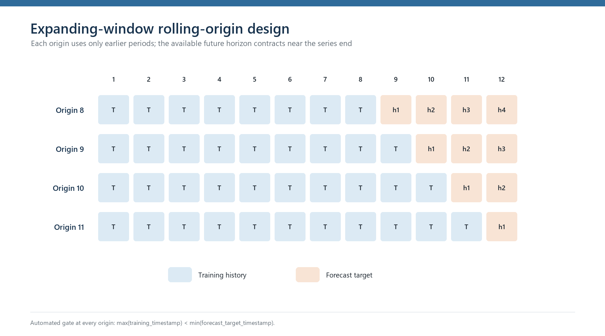

# Seasonal Demand Forecasting

## Overview

This project is an expanded portfolio rebuild derived from graduate forecasting coursework. It demonstrates seasonal baselines, parsimonious forecasting models, expanding-window rolling-origin validation, reproducible model comparison, and explicit leakage controls on a very short quarterly series.

The project is an `ANALYTICAL_DEMONSTRATION`, not a production forecasting system. The implementation passed reproducibility checks, but the data and conclusions remain subject to the limitations below.

## Why this project matters

Forecasting examples often emphasize model complexity while underemphasizing evaluation design. This project focuses on the choices that make a short time-series analysis defensible:

- compare against naive and seasonal-naive baselines;
- preserve chronological order rather than using a random split;
- refit every model using only information available at each origin;
- make horizon imbalance and overlapping forecast errors visible;
- match model complexity to the amount of available history;
- separate reproducible point forecasts from unsupported uncertainty claims.

## Dataset

The validated analysis uses 12 quarterly observations: exactly three seasonal cycles.

| Attribute | Status |
|---|---|
| Provenance | `COURSE_PROVIDED` |
| Redistribution | `VERIFY_BEFORE_PUBLICATION` |
| Observations | 12 |
| Frequency | Quarterly, represented by generic sequential periods |
| Seasonal period | 4 |
| Complete cycles | 3 |
| Original dates | Not verified |
| Units and business context | Unknown |

This repository excludes the historical workbook, processed values, and detailed execution copy. Those private references remain preserved separately. A schema-only example is provided in `data/example_schema.csv`; users must supply a compatible dataset they are authorized to use. See `data/README.md` and `LICENSE_STATUS.md`.

## Forecasting task

The task forecasts the next four generic quarters (`Y4 Q1` through `Y4 Q4`). This horizon came from the historical Year-4 assignment context and was fixed before model comparison. The labels describe cycle position only; they are not calendar dates.

## Models

| Model | Interpretation |
|---|---|
| `NAIVE` | Repeats the latest observed value. |
| `SEASONAL_NAIVE` | Repeats the latest value from the corresponding quarter; required seasonal benchmark. |
| `SEASONAL_MEAN` | Uses the mean of the available observations for each quarter. |
| `TREND_SEASONAL_ADDITIVE` | Custom OLS model with a linear trend and additive quarterly indicators. |
| `TREND_SEASONAL_MULTIPLICATIVE` | Custom historical formulation: linear trend multiplied by normalized quarter-specific demand/trend ratios. It is not Holt-Winters or ETS. |

No ARIMA, Prophet, tree ensemble, or neural-network model was added. Twelve observations cannot support credible evaluation of those extra degrees of freedom.

## Validation

Evaluation uses expanding windows, never a random split.

| Origin | Training periods | Forecast horizons |
|---:|---|---|
| 8 | 1–8 | 1–4 |
| 9 | 1–9 | 1–3 |
| 10 | 1–10 | 1–2 |
| 11 | 1–11 | 1 |

This produces 10 identical origin-target pairs per model, but the horizons are unbalanced: horizons 1–4 contribute 4, 3, 2, and 1 errors. Some realized targets appear at more than one origin, so the pooled errors are not independent trials.

Every split enforces:

```text
max(training_timestamp) < min(forecast_target_timestamp)
```

All 50 stored model forecasts passed this assertion. A separate stress test replaced the final future target with an extreme sentinel value and produced no change in any prediction.



## Results

`SEASONAL_MEAN` was the best-performing model within the evaluated demonstration, including the common one-step-only and later-origin checks. These checks support a scoped analytical selection; they do not establish general or long-run model superiority. Exact course-series metrics and data-derived figures remain held pending derivative-rights clearance. Running the code with an authorized input produces a complete comparison that includes the required seasonal-naive benchmark.

## Restricted-data visuals

Historical-series, seasonal-pattern, actual-versus-backtest, model-performance, error, and final-series charts are intentionally withheld because they expose or derive from unresolved course-provided values. The repository retains only the data-independent evaluation-design schematic above.

## Final forecast

The selected model was refit to all 12 observations. Backtest metrics and future demonstration forecasts remain separate. The workflow produces point forecasts only; the validated course-series point values are held from the rights-neutral export pending derivative-rights clearance.

No publication-quality forecast interval is claimed. A methodological review rejected the earlier pooled-residual bands for public interpretation because only 10 residual rows and four unique errors were available, the nominal 80% and 95% endpoints coincided, and coverage was not calibrated. No replacement interval was invented.

## Important limitations

> This project contains only 12 observations and three seasonal cycles. Its model rankings are demonstration evidence, not operational validation.

- The four origins yield only 10 overlapping, horizon-unbalanced forecast pairs per model.
- Seasonal relationships and trend estimates are based on very little repetition.
- Original dates, units, product identity, collection method, and business context are unknown.
- Historical data redistribution rights are unresolved.
- The final point forecasts have no publication-quality uncertainty interval.
- There is no deployment, live monitoring, company validation, cost impact, or service-level evidence.

## Reproducibility

From the repository root:

```powershell
python -m venv .venv
.\.venv\Scripts\Activate.ps1
python -m pip install -r requirements.txt
python -m unittest discover -s tests -v
python run_analysis.py --data "path\to\authorized_quarterly_data.csv"
```

The CSV must contain exactly 12 rows with `period_index`, `quarter`, and `demand` columns. Running `python run_analysis.py` without an input exits with a clear instruction instead of reaching into a private source directory.

Users with access to an authorized preserved workbook can reproduce the analysis without hard-coding its location:

```powershell
python run_analysis.py --source-workbook "path\to\authorized_workbook.xlsx"
```

The core analysis does not depend on notebook state. Detailed commands and artifact behavior are documented in `docs/reproducibility.md`.

## Repository structure

```text
repository-root/
├── README.md
├── LICENSE_STATUS.md
├── CITATION.md
├── requirements.txt
├── run_analysis.py
├── data/
│   ├── README.md
│   └── example_schema.csv
├── src/
│   ├── data_prep.py
│   ├── models.py
│   ├── evaluation.py
│   ├── metrics.py
│   └── visualization.py
├── notebooks/
│   ├── 01_exploration.ipynb
│   └── 02_forecasting_analysis.ipynb
├── tests/
├── reports/
│   ├── methodology.md
│   └── limitations.md
└── docs/
    ├── figures/                # rights-reviewed, data-independent schematic only
    ├── project_background.md
    ├── reproducibility.md
    └── public_claims.md
```

Generated tables and figures are written to the ignored local `.private_outputs/` directory. Only the individually reviewed, data-independent schematic under `docs/figures/` is included in this repository. Every input-derived table and figure remains excluded while rights are unresolved.

## Historical provenance

This repository is an expanded portfolio rebuild derived from graduate coursework. Historical coursework files are preserved separately and are not represented as the final public implementation. Historical calculations were used to reconstruct methods; only the new rolling-origin results serve as validation evidence.

## Skills demonstrated

- time-series forecasting;
- rolling-origin evaluation;
- naive and seasonal-naive benchmarking;
- MAE, RMSE, MASE, and sMAPE;
- temporal leakage prevention;
- modular Python analysis;
- reproducible testing;
- professional analytical communication.

## Rights and usage

This repository is public for portfolio review. No public license has been assigned, and the historical data are not approved for redistribution. See [LICENSE_STATUS.md](LICENSE_STATUS.md) for the current rights posture.
